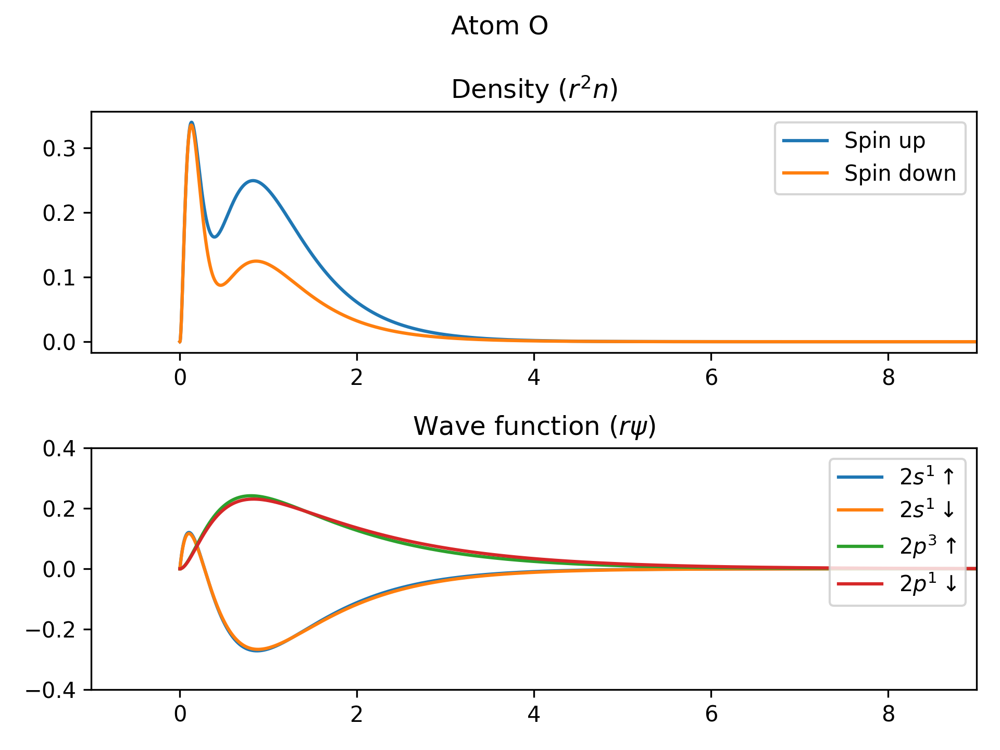
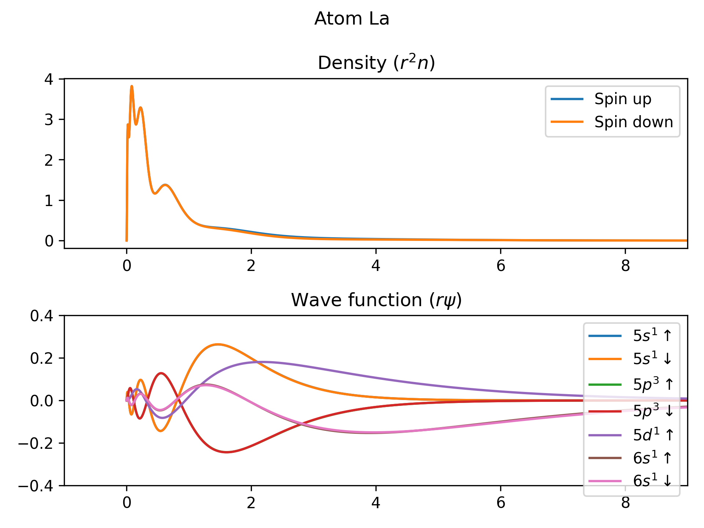
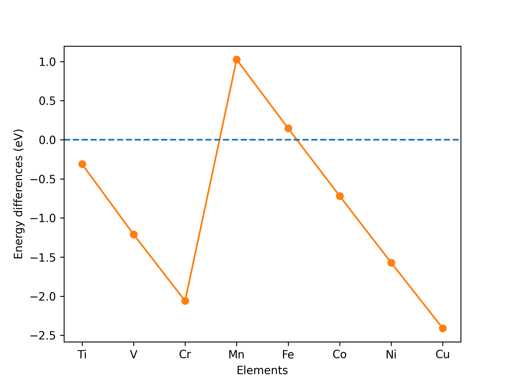

# Atom-DFT

Density functional theory of atoms

一个使用密度泛函理论求解原子轨道的程序

## Features｜特性

Local density approximation (LDA) with Slater exchange and VWN correlation, non-relativistic calculation, spin unpolarized & polarized.
Can quantitatively match the results on NIST website, with precision of 5 digits: https://www.nist.gov/pml/atomic-reference-data-electronic-structure-calculations/atomic-reference-data-electronic-7

使用密度泛函理论中局域密度近似（LDA，Slater交换、VWN关联），非相对论，支持自旋非极化/极化计算。

能对上NIST网站上的数据，小数点后5位。

## Usage｜使用方法

1. Compile C++ dynamic library using CMake, for the acceleration of eigenvalue finding.

2. Install Python packages:

   ```
   pip3 install numpy matplotlib 
   ```

   For pylibxc (Python bindings of libxc), please follow the instructions on the site https://libxc.gitlab.io/installation/

   For Python version earlier than 3.11, there is no official package tomllib. You can install tomli, and edit the following line in `atom_dft2.py`:

   ```python
   import tomllib
   ```

   To:

   ```python
   import tomli as tomllib
   ```

3. Edit `atom_config.toml` . Please refer to the comments for the format of config file.

4. Run the Python main program `atom_dft2.py`.

---

1. 用CMake编译C++动态库，用于加速特征值问题的求解

2. 安装Python包：

   ```
   pip3 install numpy matplotlib
   ```

   安装pylibxc（libxc的Python包）：请按照网站 https://libxc.gitlab.io/installation/ 上的指示进行安装。

   如果Python版本早于3.11，那么没有官方的tomllib包。你可以安装tomli，然后编辑 `atom_dft2.py`中的这一行：

   ```python
   import tomllib
   ```

   编辑为：

   ```python
   import tomli as tomllib
   ```

3. 根据计算设置，编辑 `atom_config.toml` 。配置文件格式请参考其中的注释。

4. 运行 `atom_dft2.py`进行计算。

## Gallery｜结果展示

Density and radial wave functions of oxygen (O). 氧原子的电子密度和径向波函数



Density and radial wave functions of lanthanum (La). 镧原子的电子密度和径向波函数



Electron configuration of iron (Fe). 铁的电子组态

|Orbital|Spin (up/down)|Energy (Hatree)|
|-------|--------------|---------------|
|1s1| u| -254.2036613503376|
|1s1| d| -254.20287181620876|
|2s1| u| -29.57712224932282|
|2s1| d| -29.501754081630878|
|2p3| u| -25.55553450603184|
|2p3| d| -25.498082870944934|
|3s1| u| -3.415446100964441|
|3s1| d| -3.2638104856286434|
|3p3| u| -2.24132641647898|
|3p3| d| -2.093197636613042|
|3d5| u| -0.3438042038644191|
|3d1| d| -0.2139118076205092|
|4s1| u| -0.2099875415087925|
|4s1| d| -0.1826125021370353|

Energy differences between $3d^{n+1}4s^1$ and $3d^n4s^2$ for transition metals. There are some discrepancies between theory and experiments caused by the local spin density approximation, which tends to underestimate the energy differences. Note that, except for Cr and Cu which have $3d^{n+1}4s^1$ configuration, other elements have $3d^n4s^2$ configuration from experiments. For more discussion please refer to Fig. 10.2 in Richard M. Martin, Electronic Structure. 过渡金属 $3d^{n+1}4s^1$ 和 $3d^n4s^2$ 组态下的能量差。图中的数据和实验有差别，因为LSDA会低估这个能量差。实验上，除了铬和铜的组态为 $3d^{n+1}4s^1$ ，其他过渡金属元素的组态为 $3d^n4s^2$ 。更详细的讨论请参考Richard M. Martin所著Electronic Structure中的图10.2。



## Acknowledgements｜致谢

Thanks to the project of aromanro https://compphys.go.ro/dft-for-an-atom/
and the article https://arxiv.org/pdf/1209.1752v2

感谢aromanro的博客中的项目，以及一篇arxiv论文。

## License｜版权许可

Copyright (c) 2024 YCX. Licensed under GPL (v3) License.

